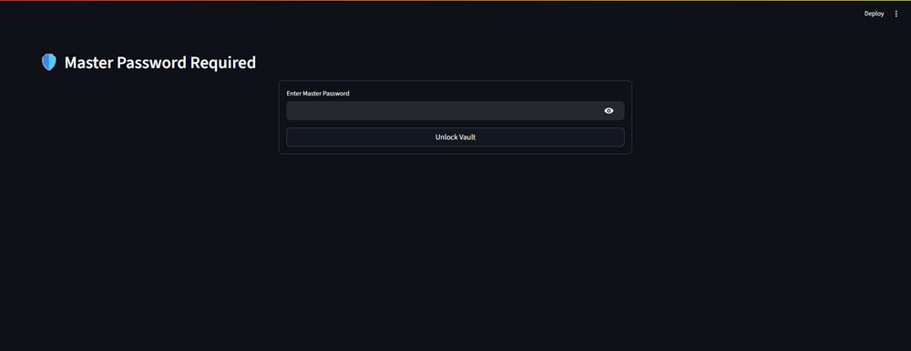
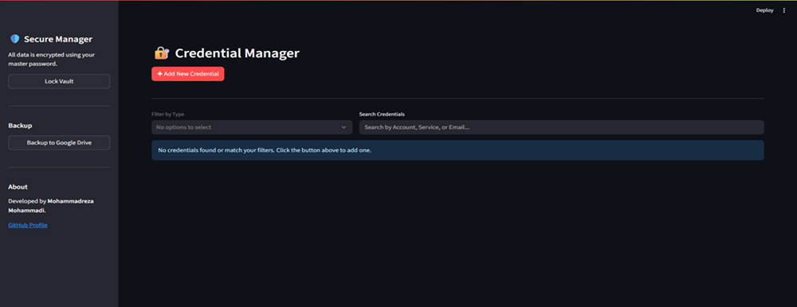

# 🛡️ Secure Credential Manager

A simple, secure, local-first password and API key manager built with Python and Streamlit. All your sensitive data is encrypted using a master password and stored locally on your machine, with an optional feature to back up the encrypted database to your personal Google Drive.

## Screenshots

| Login Screen | Main Interface |
| :---: | :---: |
|  |  |

## ✨ Features

-   **Master Password Protection:** The entire vault is secured by a single master password.
-   **Strong Encryption:** Uses AES-256 encryption via the `cryptography` library for all stored credentials. The encryption key is derived from your master password using PBKDF2HMAC with 480,000 iterations.
-   **Local-First:** All data is stored in a local SQLite database file (`credentials.db`), so your secrets never leave your machine unless you back them up.
-   **Credential Categorization:** Tag entries as "Email," "API," or "Service Password" for easy filtering.
-   **Google Drive Backup:** Securely back up your encrypted database to a private folder in your Google Drive.
-   **Secure Password Generator:** Create strong, random passwords directly within the app.

## 🛠️ Technology Stack

-   **Framework:** Streamlit
-   **Language:** Python 3.9+
-   **Database:** SQLite
-   **Encryption:** `cryptography` (Fernet/AES-256)
-   **API Integration:** Google Drive API v3

---

## 🚀 Getting Started

Follow these instructions to get the application running on your local machine.

### **Prerequisites**

-   Python 3.9 or higher
-   Pip (Python package installer)
-   A Google Account (only for the Google Drive backup feature)

### **1. Local Installation**

First, set up the project and install the required Python libraries.

```bash
# 1. Clone the repository
git clone https://github.com/mohammadreza-mohammadi94/Secure-Credential-Manager.git
cd secure-credential-manager

# 2. Create and activate a virtual environment
# On Windows
python -m venv .venv
.\.venv\Scripts\activate

# On macOS/Linux
python -m venv .venv
source .venv/bin/activate

# 3. Install the required packages
pip install -r requirements.txt
````

### **2. Google Drive Backup Setup (Optional)**

If you want to use the backup feature, you must configure Google OAuth credentials.

1.  **Go to the Google Cloud Console** and create a new project.
2.  **Enable the Google Drive API** for that project.
3.  **Configure the OAuth Consent Screen:**
      - Choose User Type: **External**.
      - Fill in the required app information (app name, support email, developer contact).
      - **Scopes:** Add the `.../auth/drive.file` scope.
      - **Test Users:** Add your own Google email address as a test user. This is crucial for allowing yourself access while the app is in "Testing" mode.
4.  **Create Credentials:**
      - Navigate to the **Credentials** tab.
      - Click **+ CREATE CREDENTIALS** -\> **OAuth client ID**.
      - Select the Application type: **Desktop app**.
5.  **Download and Save:**
      - Download the JSON file.
      - Rename it to exactly `client_secrets.json`.
      - Place it in the root directory of your project.

### **3. Running the Application**

With your virtual environment activated, run the following command from the project's root directory:

```bash
streamlit run app/main.py
```

  - **First Run:** You will be prompted to create a new master password. This password is the only way to access your data, so choose something strong and memorable.
  - **Subsequent Runs:** You will be asked to enter your master password to unlock the vault.

-----

## 🔒 Security and `.gitignore`

This project is designed to be secure, but its security depends on you **NEVER** committing your secret files to a public repository. The provided `.gitignore` file is configured to prevent this.

**The following files and folders will be ignored by Git and must remain private:**

  - `credentials.db`: Your encrypted database.
  - `client_secrets.json`: Your application's identity with Google.
  - `token.json`: The authorization token that grants access to your Google Drive.
  - `backups/`: The folder containing local database backups.
  - `.env`: Any environment variable files.
  - `.venv/`: The Python virtual environment folder.

## 📁 Project Structure

```
credential-manager/
├── app/
│   ├── main.py
│   ├── credential_manager.py
│   ├── database.py
│   ├── encryption.py
│   └── gdrive_handler.py
├── .gitignore
├── Dockerfile
├── docker-compose.yaml
├── requirements.txt
└── README.md
```

## ✍️ Author

  - **Mohammadreza Mohammadi**
